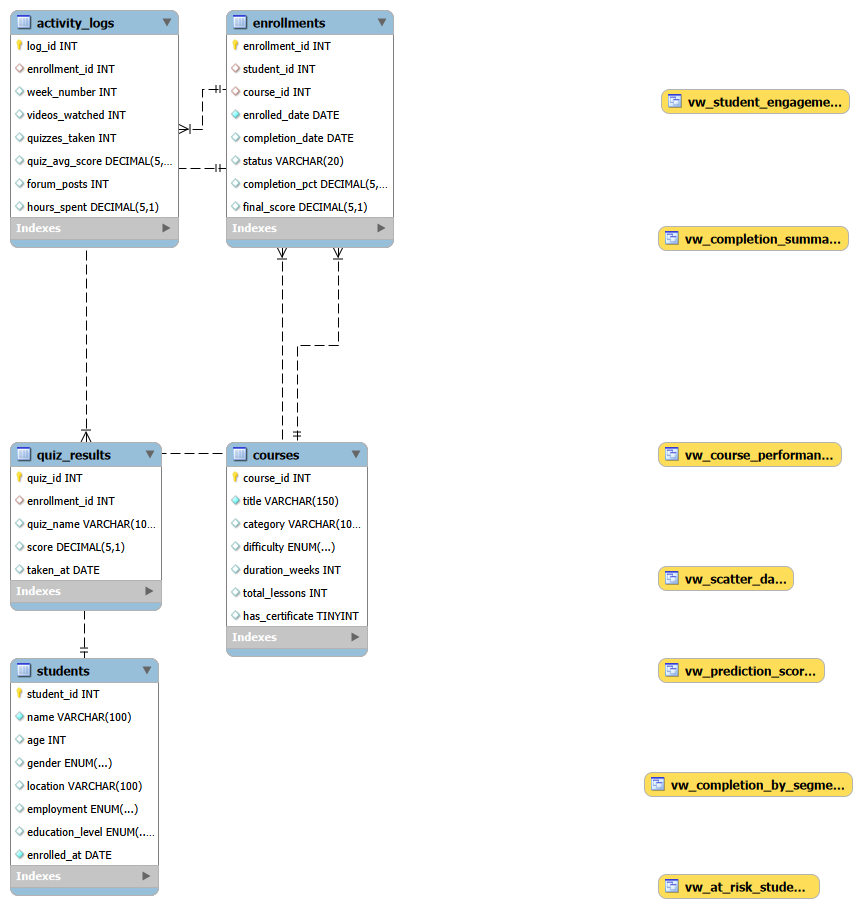
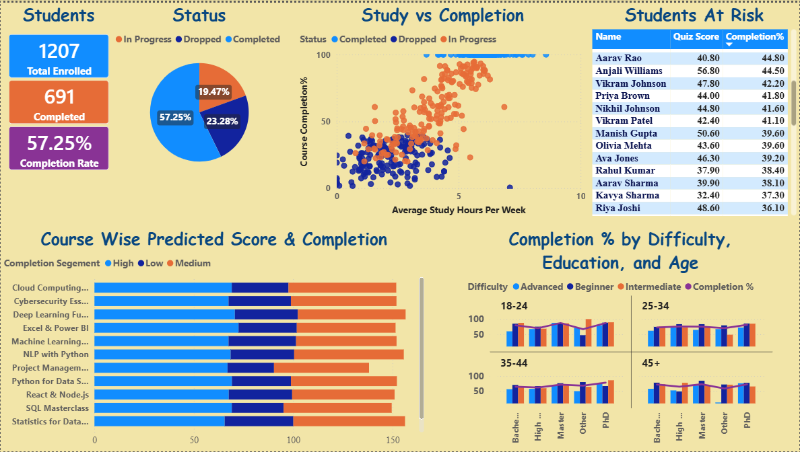

# Student Course Completion Prediction

## Project Overview
An end-to-end SQL project that analyzes student behavior on an 
online learning platform and predicts which students are likely 
to complete their courses using a weighted engagement score.

---

## Dataset
Generated synthetic dataset simulating a real e-learning platform.

| Table | Rows | Description |
|---|---|---|
| students | 500 | Demographics — age, education, employment |
| courses | 12 | Course catalog with difficulty levels |
| enrollments | 1,207 | Student-course pairs with completion status |
| activity_logs | 7,711 | Weekly engagement — hours, videos, quizzes |
| quiz_results | 4,907 | Individual quiz attempt scores |

---

## Database Schema

---

## Key Findings

| Insight | Finding |
|---|---|
| Overall completion rate | 57.2% |
| Best completing course | Python for Data Science (67.7%) |
| Worst completing course | Deep Learning Fundamentals (42.2%) |
| Completers study | 6.02 hrs/week avg |
| Dropouts study | 2.26 hrs/week avg |
| Best age group | 18-24 (69.1% completion) |
| Best education level | PhD (66.9% completion) |
| Most at-risk course | Cloud Computing (appears 4x in at-risk list) |

---

## SQL Files

| File | Description |
|---|---|
| schema.sql | Database and table creation |
| load_data.sql | CSV data loading instructions |
| analysis_queries.sql | 10 analytical queries with insights |
| views.sql | 5 reusable views |
| stored_procedures.sql | 2 callable procedures |

---

## Prediction Model

A composite score (0-100) built entirely in SQL using 5 signals:

| Signal | Weight |
|---|---|
| Hours studied per week | 30% |
| Quiz performance | 30% |
| Videos watched | 20% |
| Quizzes attempted | 10% |
| Forum participation | 10% |

Students are classified as **High / Medium / Low** likelihood 
of completion based on their score.

---

## Dashboard
Built in Power BI connecting directly to MySQL.

---

## How to Run

1. Install MySQL 8.0 and MySQL Workbench
2. Run `sql/schema.sql` to create the database
3. Load CSVs using `sql/load_data.sql`
4. Run queries from `sql/analysis_queries.sql`
5. Create views using `sql/views.sql`
6. Create procedures using `sql/stored_procedures.sql`
